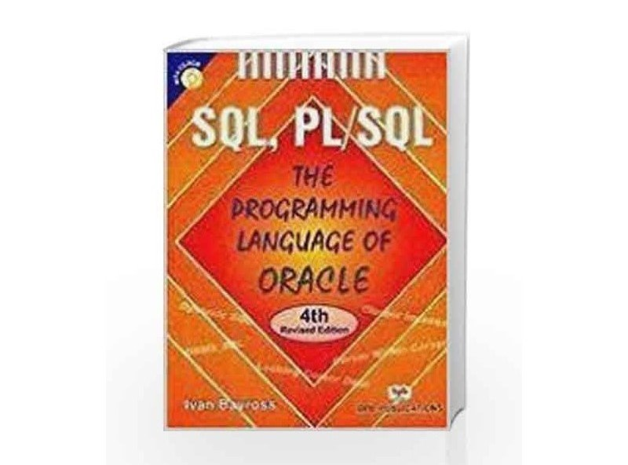

# 💼 Ankit Mishra — Personal Portfolio Website

Welcome to the **Ankit Mishra Portfolio Website**. This project is designed to showcase my profile, projects, skills, and contact information in a professional and interactive way.

## 🚀 About Me

Hi! I'm **Ankit Mishra**, a final-year BCA student and passionate Data Analyst, Software Developer, and Web Developer based in Balrampur, Uttar Pradesh, India. Currently working as a **Data Analyst Intern** at Flexing Data (SkillUp) and previously interned at TechSaksham (Microsoft & SAP Initiative) and Persist Ventures.  

> I love working with **SQL**, **Python**, **Power BI**, **Excel**, and **web technologies** to build intelligent data-driven solutions.

---

## 🌐 Live Demo

📌 Coming Soon (or you can host it on GitHub Pages / Netlify / Vercel)

---

## 📂 Project Structure

project-root/
│
├── assets/
│ ├── css/ # CSS files
│ ├── js/ # JavaScript and plugins
│ └── img/ # Images including portfolio and profile
│
├── index.html # Main HTML file
└── README.md # Project documentation (this file)

---

## 💡 Features

- **Responsive UI** with Bootstrap
- **Hero Banner** with typewriter effect
- **About Section** — bio, education, and contact
- **Resume Section** — timeline of work and education
- **Skills Section** — progress bars showing proficiency
- **Portfolio Section** — image gallery of books
- **Contact Section** — with address, email, phone, and Google Maps
- **Dark & Light Sections** for contrast
- **Font Icons** — Bootstrap Icons
- **Animated Scroll Effects** — via AOS

---

## 🛠️ Technologies Used

- **HTML5 / CSS3 / JavaScript**
- **Bootstrap 5**
- **AOS (Animate On Scroll)**
- **Glightbox for Portfolio Lightbox**
- **Typed.js for Typing Animation**
- **PureCounter for animated numbers**
- **Git & GitHub for version control**

---

## 📸 Screenshots

| Section | Preview |
|--------|---------|
| Hero |  |
| About |  |
| Books Portfolio |  |

---

## 📞 Contact

You can reach me through:

- 📧 **Email**: ankitmishra6221@gmail.com  
- 📞 **Phone**: +91 9833806221  
- 📍 **Location**: Balrampur, Uttar Pradesh, India  
- 🌐 **LinkedIn**: [Ankit Mishra](https://www.linkedin.com/in/ankit-mishra-anengineer)  
- 🐱 **GitHub**: [ankitmishra42](https://github.com/ankitmishra42)  
- 🐦 **Twitter**: [ankitmishra6221](https://x.com/ankitmishra6221?s=09)

---

## 📌 To-Do

- [ ] Add project-specific portfolios (Dashboards, Web apps)
- [ ] Host live version
- [ ] Add form functionality to contact section
- [ ] Improve mobile responsiveness

---

## 🧾 License

This project is open for personal use and modifications. Please give proper credit if you use it.

---

## 🙌 Acknowledgements

- Bootstrap Icons  
- AOS Animation Library  
- Typed.js for type animation  
- Google Fonts & Map Embed  
- Inspiration from Bootstrap portfolio templates

---

**Made with ❤️ by Ankit Mishra**
